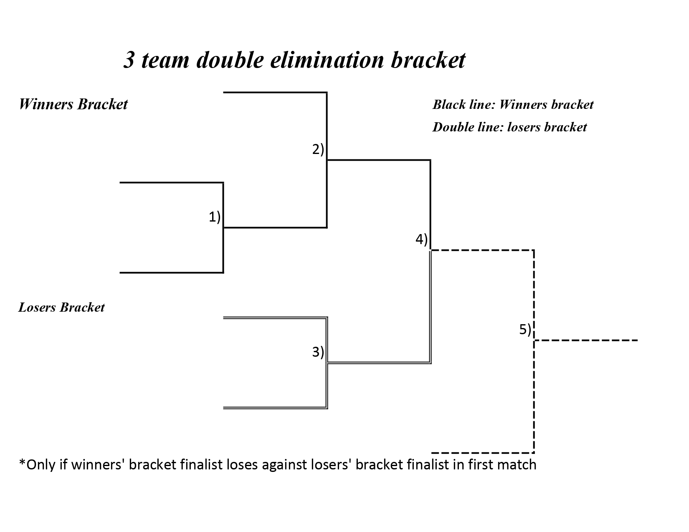

Selection: The Roulette Wheel method, the Rank method, and the Tournament Size method

Ranked vs Roulette
Ranked makes weights based on rank
Roulette makes weights based on fitness

Tournament: Have you ever watched VCT?

Crossover: single crossover point, Twopoint crossover, Order 1 (same as single) Crossover

I think it is quite self-explanatory, number of points is number of cuts

Elitism: Take the best individuals without applying anything and sending them directly to the next generation
