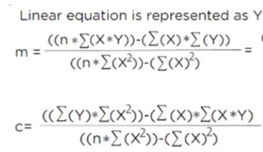
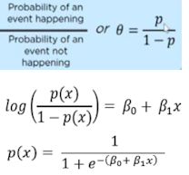
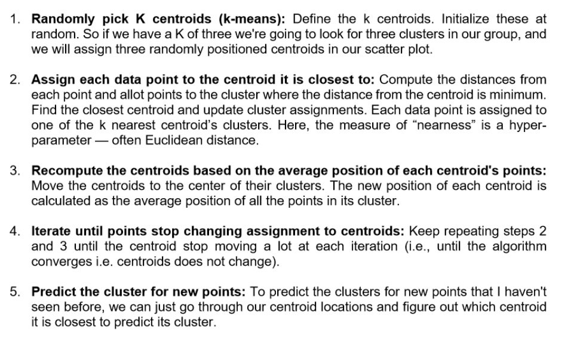
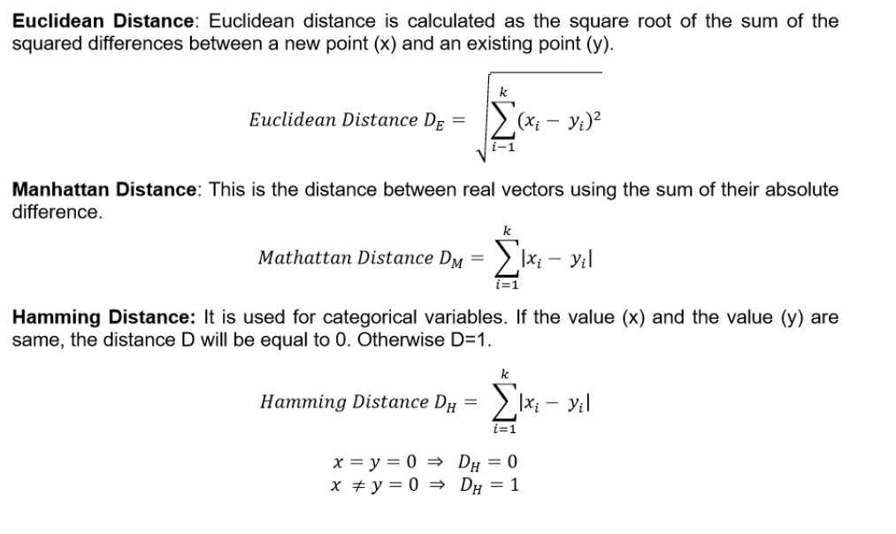
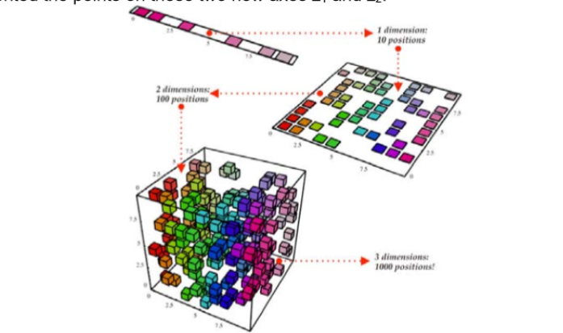

# This is simply a reference for important things to note down when writing the cheat sheet

## Chapter 1
- Turing test: Human asks a machine and a human questions. Based only from the responses, determine which is the AI and which is the human. If the human is unable to distinguish or chooses wrongly, the machine passes the turing test

## Chapter 2: Machine Learning
something something numerical discrete, continuous data and categorical, ordinal data. Recall from last semester.

- Supervised learning is using labelled data to predict 
    - Subclass: Reinforcement learning is using unlabelled data and trial of error, then improve its performance from the results of each trial
- Unsupervised learning is unlabelled data in order to find patterns

- Sampling Bias: Non-representitive training data
- No Free Lunch Theorem: There is no one size fits all model

- Classification: Separate and categorise things by classes
- Regression: Modelling technique using best fit trend line to find relationship between an independant and a dependant variable in order to predict values 

### Bias Variance Tradeoff

Bias is when it is systematically incorrect for certain data points.
Variance is how much fluctuation the output is when different data points are ran through the model, essentially the flexibility.

Balance of Precision and Recall, F1 Score = 2 * (Precision * Recall) / (Precision + Recall)

AUC-ROC = Area under curve of TP rate against FP rate

### To solve overfitting
- Choose a simpler model
    - Regularisation is a part of reducing model complexity by limiting some of the parameter coefficients close to 0
- Reduce parameters of model
- Gather more data
- Reduce noise in training data (such as outliers and errors)

Solving underfitting is the inverse of the above, plus adding better features (inputs) to the training data

### ML Algorithms
- Linear Regression: yes.
- Logistic Regression: Using 2 numerical variables and a logistic function, use logisitic function to separate graph into 2 parts. Classify points based on part.
- Decisions Tree: Literally a flow chart of yes or no questions, searches for most important feature when splitting node (so defining characterisitics to ask as a yes/no question)
- Random Forest: Several decision trees that each randomly choose subset of features and find the best features in said subset instead of most important feature overall when splitting node, then verdict of all the trees are summed and the one with the majority votes wins
- SVM: Supervised BINARY classification, for each dimension (both axis are independ ant variables), a best hyperplane line is drawn which maximises the distance to the closest distance in each class
- Naive Bayes: I am betting that this is not coming out, requires knowledge of Bayesian statistics
- kNN: Both takes K nearest neighbours of the point. Classification returns class that is in largest quantities in its k-nearest and k must not be a multiple of the classes and odd to prevent ties (usually sqrt of number of classes when number of classes is large), regression returns average of values of k-nearest
- K-Means Clustering: Cluster data into K groups by choosing centres and finding the K nearest points to be in the same class

### Linear Regression Equation

### Sigmoid function for logistic regression

### Logistic function

### Logit/Log-odds function (Inverse of the logistic function) 

### K-means clustering idea

### Distance functions
where x and y are vectors with k - 1 dimensions

To find the best K, plot graph of within cluster sum of squares to k and find the point which it plateaus

### Types of ML Algorithms
- Dimensionality Reduction: Reducing random variables being considered, divided into feature selection and feature extraction. PCA is basically just drawing a hyperplane line in each dimension and splitting it based on that in a lower dimension. Image for reference:

- Gradient Boosting: Use several weak models and combine them together to reduce the error, so I assume that random forest makes use of this

## Chapter 2: Neural Networks

### *IMPORTANT NOTE: FOR NEURAL NETWORKS THE INPUT LAYER DOES NOT COUNT TO THE TOTAL NUMBER OF LAYERS A NEURAL NET HAS*

### Perceptron Neuron
It uses a step activation function

### How to Train Your Perceptron Neuron

A single layer perceptron is unable to learn XOR which can be observed from the following image. This is because single layer perceptron can learn linearly separable functions

which is explained more clearly here

This cannot be mitigated by changing the activation function to a sigmoid or otherwise since they are still linearly separable only. Instead, using multilayer neural networks solves this problem.

### Backpropagation
Backpropagation uses a sigmoid function. (1/(1+e^-x)). Therefore, it can never reach 0 or 1.

Since the algorithm (gradient descent) for backpropagation is a little bit more complicated than the perceptron neuron, I will also be betting on this not being tested.

To optimise backpropagation to be faster, we can:
1. Use the previous change in weight of the neuron * some constant x in the change in weight of neuron formula such that it avoids local minima
2. Use hyperbolic tangent function 2a/(1+e^-bx) - a where a,b are constants
3. Increase the learning rate
