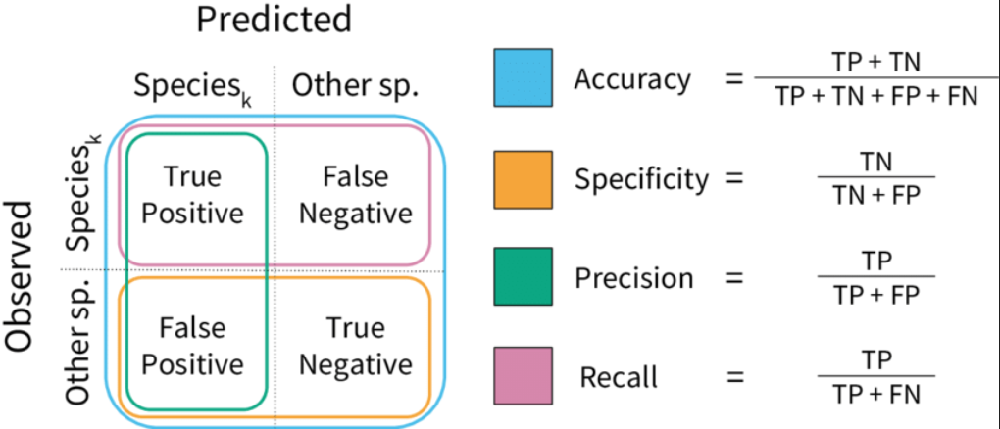
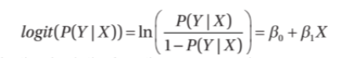

# This is simply a reference for important things to note down when writing the cheat sheet. It is not exhaustive of all the information tested.

## Chapter 1
- Turing test: Human asks a machine and a human questions. Based only from the responses, determine which is the AI and which is the human. If the human is unable to distinguish or chooses wrongly, the machine passes the turing test

## Chapter 2: Machine Learning
something something numerical discrete, continuous data and categorical, ordinal data. Recall from last semester.

- Supervised learning is using labelled data to predict 
    - Subclass: Reinforcement learning is using unlabelled data and trial of error, then improve its performance from the results of each trial
- Unsupervised learning is unlabelled data in order to find patterns

- Sampling Bias: Non-representitive training data
- No Free Lunch Theorem: There is no one size fits all model

- Classification: Separate and categorise things by classes
- Regression: Modelling technique using best fit trend line to find relationship between an independant and a dependant variable in order to predict values 

### Bias Variance Tradeoff

Bias is when it is systematically incorrect for certain data points.
Variance is how much fluctuation the output is when different data points are ran through the model, essentially the flexibility.



Balance of Precision and Recall, F1 Score = 2 * (Precision * Recall) / (Precision + Recall)

AUC-ROC = Area under curve of TP rate against FP rate

### To solve overfitting
- Choose a simpler model
    - Regularisation is a part of reducing model complexity by limiting some of the parameter coefficients close to 0
- Reduce parameters of model
- Gather more data
- Reduce noise in training data (such as outliers and errors)

Solving underfitting is the inverse of the above, plus adding better features (inputs) to the training data

### ML Algorithms
- Linear Regression: yes.
- Logistic Regression: Using 2 numerical variables and a logistic function, use logisitic function to separate graph into 2 parts. Classify points based on part.
- Decisions Tree: Literally a flow chart of yes or no questions, searches for most important feature when splitting node (so defining characterisitics to ask as a yes/no question)
- Random Forest: Several decision trees that each randomly choose subset of features and find the best features in said subset instead of most important feature overall when splitting node, then verdict of all the trees are summed and the one with the majority votes wins
- SVM: Supervised BINARY classification, for each dimension (both axis are independ ant variables), a best hyperplane line is drawn which maximises the distance to the closest distance in each class
- Naive Bayes: I am betting that this is not coming out, requires knowledge of Bayesian statistics
- kNN: Both takes K nearest neighbours of the point. Classification returns class that is in largest quantities in its k-nearest and k must not be a multiple of the classes and odd to prevent ties (usually sqrt of number of classes when number of classes is large), regression returns average of values of k-nearest
- K-Means Clustering: Cluster data into K groups by choosing centres and finding the K nearest points to be in the same class

### Linear Regression Equation


### Sigmoid function for logistic regression


### Logistic function


### Logit/Log-odds function (Inverse of the logistic function) 



### K-means clustering idea


### Distance functions
where x and y are vectors with k - 1 dimensions

To find the best K, plot graph of within cluster sum of squares to k and find the point which it plateaus

### Types of ML Algorithms
- Dimensionality Reduction: Reducing random variables being considered, divided into feature selection and feature extraction. PCA is basically just drawing a hyperplane line in each dimension and splitting it based on that in a lower dimension. Image for reference:

- Gradient Boosting: Use several weak models and combine them together to reduce the error, so I assume that random forest makes use of this

## Chapter 2: Neural Networks

### *IMPORTANT NOTE: FOR NEURAL NETWORKS THE INPUT LAYER DOES NOT COUNT TO THE TOTAL NUMBER OF LAYERS A NEURAL NET HAS*

### Perceptron Neuron
It uses a step activation function


How to Train Your Perceptron Neuron


A single layer perceptron is unable to learn XOR which can be observed from the following image. This is because single layer perceptron can learn linearly separable functions


which is explained more clearly here


This cannot be mitigated by changing the activation function to a sigmoid or otherwise since they are still linearly separable only. Instead, using multilayer neural networks solves this problem.

### Backpropagation
Backpropagation uses a sigmoid function. (1/(1+e^-x)). Therefore, it can never reach 0 or 1.

How it works:


To optimise backpropagation to be faster, we can:
1. Use the previous change in weight of the neuron * some constant x in the change in weight of neuron formula such that it avoids local minima
2. Use hyperbolic tangent function 2a/(1+e^-bx) - a where a,b are constants
3. Increase the learning rate

ReLu Activation Function    


## Chapter 2: Convolutional Neural Networks

For convolutional layers, they are superimposed onto the original image and multiplied for each corresnponding pixel. Then it is summed up and forms the top left pixel.


Unlike the above image, pooling does not use overlap in inputs. Refer to below image input matrix and output matrix shape for clarity.


Honestly I don't know what else to write for this.

## Chapter 2: Generative Models
Transformers tokenise their inputs multiple times through a token network like how you would run things through a neural network

Attention is basically the query, key and value vectors calculated from each token of the input. If the query is met the key value is larger. We then find similarity by multiplying the query times the key value. The attention would be softmax applied to the similarity.


We calculate value as the sum of the product of attention and value vector of each token.

#### Pictorial Representation


## Chapter 3: Search Problems
### Terminology
A transition model carries out the action and the action is the change that is done. So if you move a knight piece in chess, then the hand or the player would be the transition model.

- Environment: Setting for search problem
- Agent: Entity that interacts with the environment
- 

### BFS Code
```py
def bfs(graph, start):
    frontier = [start]
    visited = []

    while frontier:
        # replace 0 with nothing for dfs
        currnode = frontier.pop(0) 
        visited.append(currnode)
        for child in graph[currnode]:
            if child not in visited and child not in frontier:
                frontier.append(child)

    return visited
```

BFS will always terminate with the best solution but is computationally expensive and chronically long. DFS is reverse (might get stuck in infinite loop)

For A*, the estimated cost for any node is the shortest path cost from the start node to the node plus the estimated distance (using the distance functions) to the goal node.


## Chapter 4: Genetic Algorithms
Steady state population model is 1-2 offspring is generated each iteration to replace 2 parents from the population.

Generational population model replaces all parents.
### Terminology

- Population: All possible solutions
- Chromosomes: A particular set of solution
- Gene: 1 element position of a chromosome
- Allele: Value a gene takes for a particular chromosome
- Genotype: Solutions represented in a way for machines to understand easily
- Phenotype: Solutions represented in the real world situation 
- Encoding/Decoding: Phenotype to Genotype/Genotype to Phenotype
- Fitness function: Evaluates how well the solution works to solve the problem
- Genetic operators: Alters genetic composition of offspring (crossover, mutation, selection)
- Crossover: Method of merging genetic information of 2 individuals
- Mutation: Random deformation or change in the chromosomes
- Selection: Mechanism to choose parents to produce offspring using the fitness function
- Elitism: Take the best individuals without applying any genetic operators and sending them directly to the next generation

## Cycle of Genetic Algorithms


## Selection Methods
- Roulette Wheel: Each chromosome has a weighted chance to be chosen as a parent based on its fitness as compared to the fitness sum of the population. Select one parent based on the chances
- Stochastic Universal Sampling: Roulette Wheel but for both parents at the same time
- K-way Tournament: Choose K random chromosomes from the population and out of those chosen, pick the best one to be parent
- Rank: Only for population with chromosomes with close fitness, the chromosomes are sorted by rank and uses the rank as the weighted chance to be selected as parent

## Crossover Methods
- N-point crossover: Chooses N points to split both parents and alternate each section as the child
- Uniform crossover: Every allele of each parent has a chance (weighted or not) to be chosen as offspring allele

## Mutation Operators
- Bitflip: Not.
- Swap: Swap allele of 2 random positions in child
- Scramble: Subset of genes are scarambled
- Inversion: Subset of genes are reversed in order

## Selection Operators (Steady state populations only)
- Age based selection: Oldest is removed to be replaced by new offspring
- Fitness based selection: I am sure you can figure this one out